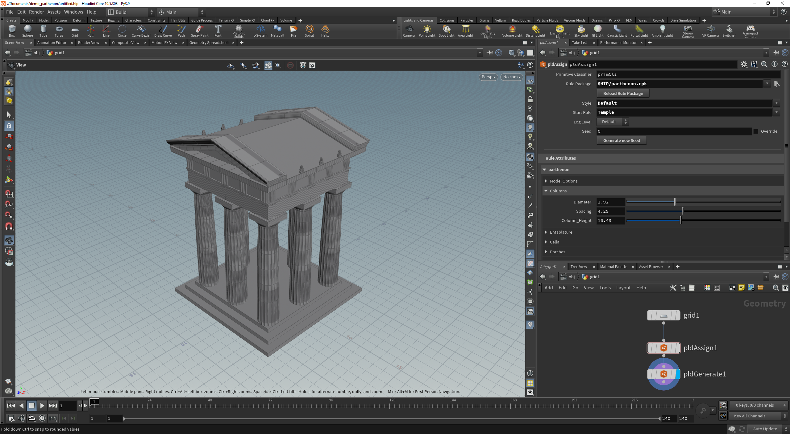
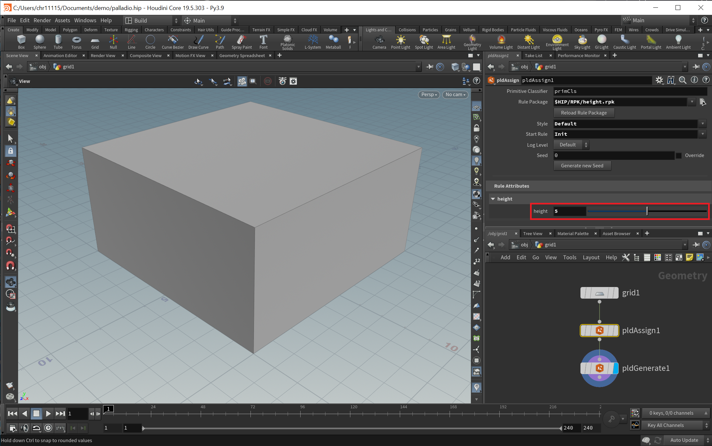
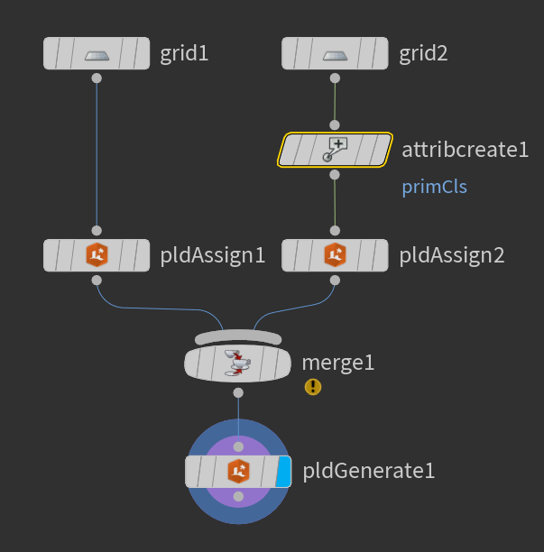
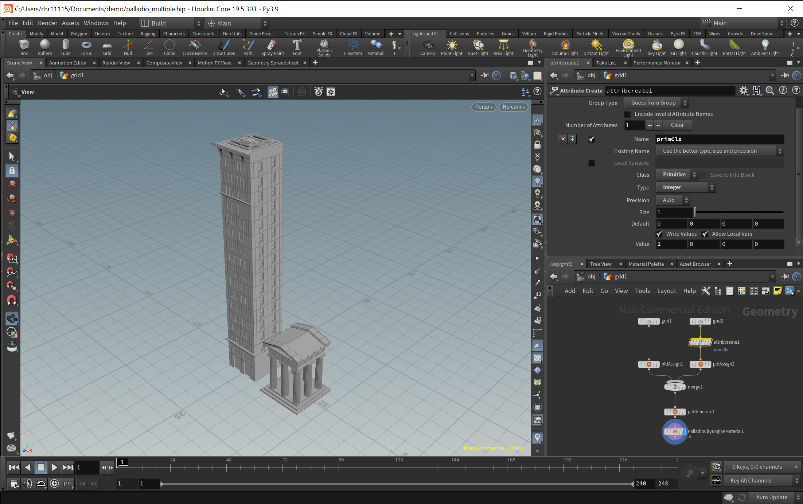
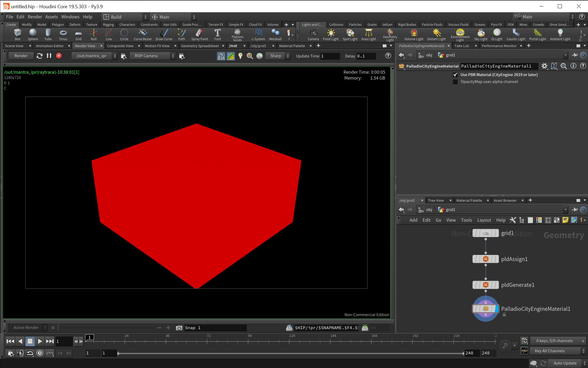
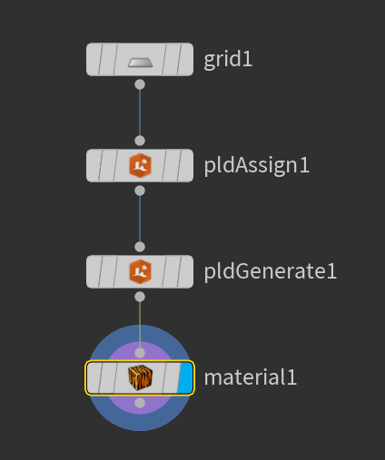
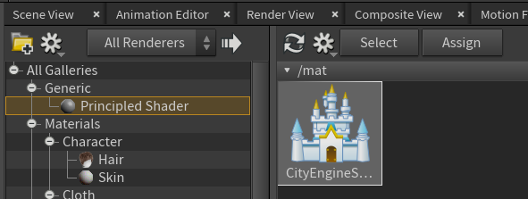

#  Palladio - CityEngine Plugin for Houdini

Palladio is a plugin for [SideFX Houdini](https://www.sidefx.com). It provides operator nodes which enable the execution of [CityEngine](https://www.esri.com/software/cityengine) ‘rules’ within Houdini networks. Therefore, a 3D environment artist does not have to leave their familiar Houdini toolset anymore to make use of CityEngine’s procedural modeling power. Complicated export-import pipelines are no longer needed, which also means that the procedural building models do not need to be “baked” anymore. The buildings stay procedural during the entire modeling workflow (optionally even at render time). Consequently, the 3D environment artist can change the height, style and appearance of buildings easily with a parametric interface at any point during production.

Palladio requires so-called rule packages (RPK) as input, which are authored in CityEngine. An RPK includes assets and a CGA rule file which encodes an architectural style. Comprehensive RPK examples are available below and can be used “out-of-the-box” in Palladio.

Palladio is well suited for managing the procedural generation of architectural 3D content in digital sets. However, Palladio is restricted to the procedural generation of single buildings / objects. Palladio does not include the city layouting and street network editing tools of CityEngine i.e. the rich CityEngine toolset to design a city from scratch (or based on geographic data) is still needed.

## Quick Start

1. Download the latest Palladio binary from the [release page](https://github.com/esri/palladio/releases).
1. Extract the archive into your `<home>\Documents\houdiniX.Y` (Windows) or `<home>/houdiniX.Y` (Linux) directory, so that the files end up in the corresponding `config`, `dso` and `packages` sub-directories.
1. Start Houdini and you will find the new `pldAssign` and `pldGenerate` nodes in the OBJ operator menu under `custom`.
1. In Houdini, create a quad as initial shape by setting up a `grid` node with 2 cols/rows.
1. Open the geometry node in the network editor and connect the mesh output to a new `pldAssign` node.
1. Create a new `pldGenerate` node and connect the input to the ouput of the previous `pldAssign` node.
1. Make the `pldGenerate` node the active render node.
1. Download [the Parthenon rule package](/doc/data/parthenon.rpk). Or alternatively, in CityEngine, download [Tutorial 9](https://doc.arcgis.com/en/cityengine/latest/tutorials/tutorial-9-advanced-shape-grammar.htm) and export the "Parthenon" CGA rule to a RPK (see [Creating a Rule Package](https://doc.arcgis.com/en/cityengine/latest/help/help-rule-package.htm)).
1. Select the `pldAssign` node and set the `Rule Package` parameter in the parameter editor to the path of the previously exported RPK.
1. The model should generate and rule attributes should now be editable inside the parameter editor.

     

## Table of Contents

* [User Manual](#user-manual)
* [Downloads](https://github.com/Esri/palladio/releases)
* [Examples](https://esri.github.io/cityengine/palladio#examples)
* [Developer Manual](#developer-manual)
* [Release Notes](#release-notes)
* [Licensing Information](#licensing-information)

External documentation:
* [CityEngine Tutorials](https://doc.arcgis.com/en/cityengine/latest/tutorials/introduction-to-the-cityengine-tutorials.htm)
* [CityEngine CGA Reference](https://doc.arcgis.com/en/cityengine/latest/cga/cityengine-cga-introduction.htm)
* [CityEngine Manual](https://doc.arcgis.com/en/cityengine/latest/help/cityengine-help-intro.htm)
* [CityEngine SDK API Reference](https://esri.github.io/esri-cityengine-sdk/html/index.html)
* [Houdini HDK Reference](https://www.sidefx.com/docs/hdk)  

## User Manual

Please refer to the [release notes](#release-notes) for the supported CityEngine version.
### Installation

#### Software Requirements (Latest Release)
* Windows 10 or 11 (64bit)
* RedHat Enterprise Linux 7 or 8 and compatible (CentOS, Alma Linux, Rocky Linux, ...)
* Houdini 18.5, 19.0 or 19.5
* The latest release requires CityEngine 2022.0 or older for creating rule packages.
* For commercial work, a [license](https://esri.com/cityengine) for CityEngine 2019.0 or later is required.

#### From Pre-Built Binaries

1. Download the latest Palladio binary from the [release page](https://github.com/esri/palladio/releases).
1. Extract the archive into your `<home>\Documents\houdiniX.Y` (Windows) or `<home>/houdiniX.Y` (Linux) directory, so that the files end up in the `config`, `dso` and `packages` sub-directories.
1. Start Houdini and you will find the new `pldAssign` and `pldGenerate` nodes in the OBJ operator menu under `custom`.

Note: it is NOT necessary to modify the system `PATH` environment variable.

#### From Source

1. [Build](#developer-manual) Palladio
1. The `install` step should automatically copy all required files into your `<home>\Documents\houdiniX.Y` (Windows) or `<home>/houdiniX.Y` (Linux) directory and Palladio is ready to run.

### Using Palladio

Palladio adds the two new geometry (SOP) nodes `pldAssign` and `pldGenerate` to Houdini in the 'Custom' category. These can be created inside of any geometry object in the `Network Editor`.

#### pldAssign Node

The `pldAssign` node is designed to create the required metadata to the input geometry (as primitive attributes) such that the `pldGenerate` operator can procedurally generate the geometry.
When selected, a RPK (rule package), seed and corresponding CGA attributes can directly be set in the parameter editor. 
When evaluated, the `pldAssign` node attaches the required metadata to the geometry (in the form of primitive attributes) and updates the CGA attributes in the parameter editor accordingly.
The primitive attributes can also be overwritten before the geometry is passed to a `pldGenerate` node (i.e using an `Attribute Create` node).

#### pldGenerate Node
The `pldGenerate` node is used to generate the final geometry. 
It takes an initial shape geometry with metadata as input (i.e. the output of a `pldAssign` node) and executes the CityEngine rule to generate a 3D model.
In the parameter editor we have the options to:
* re-emit modified CGA attributes
* emit material attributes
* emit CGA reports

### Execute a simple CityEngine Rule
    
1. In CityEngine, create the following rule file and share it as a rule package (RPK) to disk somewhere (or download one of the provided examples and share it as a RPK (see [Creating a Rule Package](https://doc.arcgis.com/en/cityengine/latest/help/help-rule-package.htm))):
   ```
   attr height = 1
   
   @StartRule
   Init -->
      extrude(height)
   ```
   (Instead you can also directly use [this](doc/data/heightExtrude.rpk) RPK)
1. In Houdini, in a new scene, add a `grid` node.
1. Enter the `grid` node, set the `Rows` and `Columns` parameters to two and add the two Palladio nodes `pldAssign` and `pldGenerate`. Connect them like this:

    
1. Select the `pldAssign` node and set the `Rule Package` parameter to the path of the previously exported RPK in the parameter editor.
1. Make the `pldGenerate` node the active render node, this will trigger a "cooking" of the assign and generate nodes and execute the CityEngine Rule. You should now see a cuboid:

    

### Overriding Rule Attributes

In the previous section we've used the default value for the `height` attribute. Let's use Houdini tools to modify the rule attribute prior to execution.

#### Using Parameter Editor

1. Make sure the `pldAssign` is evaluated by making the connected `pldGenerate` the active render node
1. Edit the rule attribute in the parameter editor by changing the value in the generated handle (a rule attribute can be reset by calling `revert to Defaults` or pressing `ctrl + MMB` on the rule name)

    
#### Manual Override

1. Add an `AttributeCreate` node between `pldAssign` and `pldGenerate`.
1. Set the attribute name to `height` and the `Class` to `Primitive`. The extrusion vanishes because the default value is 0.
1. Increase the value for `height` to see an actual extrusion: 

    

Please note the steps for the general case:
1. See the CGA file (or CityEngine) for the available attributes and their data types (number, string, boolean). 
1. In the `AttributeCreate` node, set `name` to the name of the CGA attribute (make sure to check `Encode Invalid Attribute Names`).
1. Set `class` to `Primitive`.
1. Set `type` to `Float` for CGA number attributes, `String` for CGA strings and `Integer` with 8 bit precision for CGA booleans.

### Working with multiple Assign Nodes

In this section, we are going to showcase how we can use multiple `pldAssign` nodes with a single `pldGenerate` node.

1. Duplicate the `grid` and `pldAssign` nodes.
1. Set the Center of the second `grid` node to (15, 0, 0).
1. Add a new `Attribute Create` node between the new `grid` and `pldAssign` nodes.
1. Set the attribute name to "primCls", change the Class to primitive and change its value to 1. This value needs to be set such that the `pldGenerate` node later knows which initial faces should be generated together or separately.

    
1. Merge the output of both assign nodes with a `merge` node and feed the output to the previous generate node like this:

    
1. You can now change the rule files and attributes of both `pldAssign` nodes and it should generate them correctly

    

### Working with Material Attributes

In this section, we are going to connect a material attribute generated by `pldGenerate` with a Mantra shader (the same mechanism can also be used for Viewport materials).

#### Using provided HDA

1. Download the ready-made Houdini Digital Asset with a [CityEngine Material for Mantra](https://github.com/Esri/palladio/releases/download/v1.6.1/PalladioCityEngineMaterial-v2.hdanc).
1. Import the HDA to your current project (`File`>`Import`>`Houdini Digital Asset`) and click install.
1. Select the `pldGenerate` node and check the `Emit material attributes` check box. Open the spreadsheet to observe a number of material primitive attributes now being emitted by `pldGenerate`.
1. Create a new PalladioCityEngineMaterial node and connect it to the `pldGenerate` node. Make it the active render node.
1. Hit Mantra render and you should see a red box in the render view.

    

#### Creating a new custom Shader

1. Extend the rule from the [previous section](#execute-a-simple-cityengine-rule) with a `color` statement and re-export it:
    ```
    attr height = 1

    @StartRule
    Init -->
       color(1,0,0)
       extrude(height)
    ```
	(Instead you can also directly use [this](doc/data/heightExtrude.rpk) RPK)
     
1. In Houdini, select the `pldGenerate` node and check the `Emit material attributes` check box. Open the spreadsheet to observe a number of material primitive attributes now being emitted by `pldGenerate`.
1. Add a `Material` node and connect it to the `pldGenerate` node. Make it the active render node:
    
    
1. In the `Material Palette`, create a new `Principled Shader` instance (by dragging it from the navigator to the `\mat` window) and rename it to `CityEngineShader`:

    
1. Enter the `CityEngineShader` node and connect a `Parameter` node to the `Surface/basecolor` input:

     

1. Set the name of the `Parameter` node to `diffuseColor` and also set the type to `Color`. This name will match the primitive attribute emitted by `pldGenerate`.

    

1. Back in the network of the `grid` node, select the `Material` node and select `/mat/CityEngineShader` for the `Material` parameter.

1. Hit Mantra render and you should see a red box in the render view.

    

### Tips and Tricks

#### How to export an Alembic from CityEngine as input to Palladio

This short CityEngine guide explains how to include the random seed and start rule assignments when exporting input geometry to Alembic.

1. Run the following Python script on your scene objects to assign the random seed as object attributes: 
   ```python
   from scripting import *

   ce = CE()

   shapes = ce.getObjectsFrom(ce.scene(), ce.isShape)
   for s in shapes:
       seed = ce.getAttribute(s, "/ce/rule/randomSeed")
       ce.setAttribute(s, "seed", seed)
   ```
1. Assign this CGA script to the desired shapes to report out `seed` and `rule` (the start rule):
   ```
   version "2019.0"

   attr seed = 0

   Lot --> R	
   LotInner --> R
   Street --> R
   Sidewalk --> R
   Crossing --> R
   OpenSpace --> R
   Joint --> R
   R -->
       report("seed", seed)
       report("rule", initialShape.startRule)
   ```
    The `seed` rule attribute should have been connected to the previously assigned `seed` object attribute.
1. Export the shapes to Alembic, the two report values are now attached as user properties to the meshes.

#### Keep CityEngine Rule Packages in the Houdini Project

It can be useful to put RPKs into an `rpk` sub-directory of your current Houdini project. If you use `$HIP` to refer to the RPK in the pldAssign node, your Houdini project will stay relocatable.

#### Environment Variables

* `CITYENGINE_LOG_LEVEL`: controls the global (minimal) log level for all assign and generate nodes. Valid values are "debug", "info", "warning", "error", "fatal". The default is "error". Additionally, the log level can be controlled for each `pldAssign` and `pldGenerate` instance.
* `HOUDINI_DSO_ERROR`: useful to debug loading issues, see https://www.sidefx.com/docs/houdini/ref/env

## Developer Manual

### Supported Operating Systems
* Windows 10 or 11 (64bit)
* RedHat Enterprise Linux 7 or 8 and compatible (CentOS, Alma Linux, Rocky Linux, ...)
 
### Required Toolchain & Compiler
* [cmake 3.13 or later](https://cmake.org/download)
* [conan 1.20 or later](https://www.conan.io/downloads)
* Linux: GCC 9.3
* Windows: Visual Studio 2019 (MSVC 14.27)

### Required Build Dependencies (Latest Release)
* Installation of Houdini 18.5, 19.0 or 19.5 (see https://sidefx.com/download)

The following will be automatically fetched via the bootstrap steps below: 
* [CityEngine SDK](https://github.com/esri/cityengine-sdk)
* SideFX Houdini HDK


### Build Instructions

Default is Houdini 19.5. See below how to build for different Houdini versions.

#### Bootstrap

The below steps will populate your local Conan repository with dependencies for the Palladio build system. You only need to work through this section once (or if you want to upgrade one of the dependencies).

##### Linux
1. Checkout Palladio: `git clone git@github.com:esri/palladio.git && cd palladio`
1. Download CityEngine SDK: `conan create -pr conan/profiles/linux-gcc93 conan/cesdk cesdk/2.6.8300@esri-rd-zurich/stable`
1. Extract and package the HDK from your local Houdini 19.5 installation (adjust Z to your Houdini version): `conan create -pr conan/profiles/linux-gcc93 conan/houdini houdini/19.5.Z@sidefx/stable` (Note: use the option `-e HOUDINI_INSTALL=/path/to/your/hfs19.5.Z`, if Houdini is not installed at the standard location, e.g. at `/opt/hfs19.5.Z` for Linux).

##### Windows
1. Checkout Palladio: `git clone git@github.com:esri/palladio.git`
1. Open a Windows command shell and `cd` to the Palladio git repository
1. Download CityEngine SDK: `conan create -pr conan/profiles/windows-v142 conan/cesdk cesdk/2.6.8300@esri-rd-zurich/stable`
1. Extract and package the HDK from your local Houdini installation (adjust Z to your Houdini version): `conan create -pr conan/profiles/windows-v142 conan/houdini houdini/19.5.Z@sidefx/stable` (Note: use the option `-e HOUDINI_INSTALL=C:/path/to/your/houdini/installation`, if Houdini is not installed at the standard location for Windows).

#### Building Palladio

Note: to build for another Houdini version, add the cmake argument `-DPLD_HOUDINI_VERSION=X.Y`.

##### Linux
1. Ensure GCC 9.3 is active.
1. `cd` into your Palladio git repository
1. `mkdir -p build/release && cd build/release`
1. `cmake -DCMAKE_BUILD_TYPE=Release ../../src`
1. `make install` (the plugin will be installed into your `~/houdini19.5/dso` directory)

##### Windows
1. Open a MSVC 14.27 x64 shell (Visual Studio 2019) and `cd` to the Palladio git repository
1. `mkdir build/release`
1. `cd build/release`
1. `cmake -G "NMake Makefiles" -DCMAKE_BUILD_TYPE=Release ../../src`
1. `nmake install` (the plugin will be installed into your `%USERPROFILE%/Documents/houdini19.5/dso` directory)

#### Debugging Palladio

For the best debugging UX, please use the build type `RelWithDebInfo` when running CMake (or in Visual Studio).
The `Debug` mode does not work as it will result in incompatible ABI between Houdini, PRT and the Palladio client code.

### Running Palladio
See [Quick Start](#quick-start) how to launch Houdini with Palladio.

### Building and Running Unit Tests

#### Linux
1. Ensure GCC 9.3 is active.
1. `cd` into your Palladio git repository
1. `mkdir -p build/relTest && cd build/relTest`
1. `cmake -DCMAKE_BUILD_TYPE=Release -DPLD_TEST=1 ../../src`
1. `make palladio_test`
1. Run `bin/palladio_test`

#### Windows
1. Open a MSVC 14.27 x64 shell (Visual Studio 2019) and `cd` to the Palladio git repository
1. `mkdir build/relTest`
1. `cd build/relTest`
1. `cmake -G "NMake Makefiles" -DCMAKE_BUILD_TYPE=Release -DPLD_TEST=1 ../../src`
1. `nmake palladio_test`
1. Run `bin\palladio_test`

## Release Notes

### v2.0.0 Beta 2 (Mar 27, 2023)

Required CityEngine version: 2022.1 or older

#### Changed:
- Changed indexing of generated meshes: all vertex attributes now have separate indices. This improves mesh connectivity and sharing of points.
- Fixed rule attribute overrides for multiple initial shapes
- Fixed two bugs in the "FileSystem Helper" when reading textures from RPKs (fixes rendering with Mantra) 
- Updated Procedural Runtime (PRT) to 2.7.8538 (corresponds to CityEngine 2022.1)

#### Development:
- Turned off optimization for config `RelWithDebInfo` to have better debugger experience
- Added workaround for Conan/CMake and the Visual Studio CMake generator
- Added tests to generated Visual Studio solution. Tests can now be started and debugged in Visual Studio by setting the test project as startup project.
- Updated cmake-conan integration to 0.18.1
- Updated developer docs

### v2.0.0 Beta 1 (Nov 22, 2022)

Required CityEngine version: 2022.0 or older

#### Added:
- Support for Houdini 19 and 19.5
- Rule attribute parameters to directly edit them in the parameter editor of the `pldAssign` node
  - Rule attribute handles dynamically update when the `pldAssign` node is evaluated
  - Rule attribute values can be reset to the default value
  - CGA annotations will create different UI widgets, for example a color picker or file browser
- Seed parameter to change the seed value in the `pldAssign` node
- Icon to Palladio nodes

#### Changed:
- Updated Procedural Runtime (PRT) to 2.6.8300 (corresponds to CityEngine 2022.0)
- Rule attribute names can now be encoded using Houdini's string encoding
- Fixed issues with rule package paths containing white spaces
- Fixed loading of rule packages embedded in HDAs (Houdini Digital Assets)
- Updated and restructured user manual

#### Development:
- Updated compilers (now using C++ 17)
- Linux version is now compiled with GCC 9.3 by default
- Updated test framework and build system
- Cleaned up CMake files

#### Removed
- Support for Houdini 18.0 and older

### v1.9.0 (Dec 7, 2020)
* No functional changes compared to Beta 2.

### v1.9.0 Beta 2 (Dec 2, 2020)
* Updated doc section for "overriding rule attributes".
* General doc cleanup. 

### v1.9.0 Beta 1 (Nov 16, 2020)
* Update default CityEngine SDK to 2.3 (CityEngine 2020.1).
* Added support for Houdini 18.5.
* Add error message to assign node in case of e.g. invalid rule package (#159).

### v1.8.0 (Oct 5, 2020)
* No functional changes compared to Beta 1.

### v1.8.0 Beta 1 (Aug 23, 2020)
* Update default CityEngine SDK to 2.2 (CityEngine 2020.0) (#146).
* Added support for CGA array attributes (#146).
* Added per-node control of log level (#30).
* At startup, print Palladio version on console if log level is "info" or lower.
* Development
  * On Windows, building Palladio now requires MSVC 14.2 (#146).
  * Various code cleanups and adoption of clang-format rules from [Serlio](https://github.com/esri/serlio).
  * Pruned releasing for Houdini 17.0 (you can still build yourself for 17.0).
  * Relaxed Python/Conan version requirements.

### v1.7.0 (June 14, 2020)
* No functional changes compared to Beta 1 

### v1.7.0 Beta 1 (Dec 9, 2019)
* Added support for Houdini 18 and removed Houdini 16 (#143).
* Updated built artifacts to latest Houdini versions (#139).
* Filter unnecessary components of PRT from release (#141).
* Fixed pipeline to not install files outside of the install directory (#138).

### v1.7.0 Pre-Release (Oct 20, 2019)
* Improved setting start rule from primitive attribute (i.e. do not prepend style to start rule if it is already present).
* Improved installation experience (avoid setting OS PATH on Windows).
* Update default CityEngine SDK version to 2.1 (CityEngine 2019.1).
* Only pass non-default rule attribute values to PRT. This fixes setting inter-dependent rule attributes.

### v1.6.3 (July 27, 2019)
* Optimized cooking time of pldGenerate (e.g. Parthenon example from CityEngine tutorial 9 cooks 7x faster)
* Added "tips and tricks" section with guide how to export Alembics from CityEngine for Palladio

### v1.6.2 (June 22, 2019)
* Fixed broken texture coordinates in the generated Houdini geometry in case not all PRT meshes had any (#118).

### v1.6.1 (June 7, 2019)
* Added support for texture coordinates on incoming initial shapes (#112).
* Assign SOP: do not overwrite main attributes like pldStartRule if they are already present on the incoming geometry (#111).
* Assign SOP: fixed rule attribute default value evaluation (each primitive can have different main attributes) (#111).
* Fixed support for PolygonSoup primitives as initial shapes (#110).

### v1.6.0 (May 8, 2019)
* Added support for PRT 2
* Removed technical requirement for CityEngine license.
* Added support for new PRT PBR material attributes.
* Various build system improvements (supports both PRT 1.x and 2.x).

### v1.5.0 (May 7, 2019)
* No functional change to beta 2.

### v1.5.0 Beta 2 (Mar 19, 2019)
* Fixed crash in pldAssign node if no RPK is set.

### v1.5.0 Beta 1 (Mar 14, 2019)
* Added support for Rule Packages (RPK) embedded in Houdini Digital Assets (HDA)
* Added support for Houdini 17.5

### v1.4.1 (Mar 11, 2019)
* Always use UV set 0 as a fallback (mimics CityEngine behavior).
* Internal cleanup: Simplified UV coordinate transport between PRT and Palladio.

### v1.4.0 (Feb 27, 2019)
* Generated material primitive attributes now use the "generic names" instead of the "CGA names" (see PRT reference for file prtx/Material.h for details).
* Fixed wrong texture paths for assets that originated in another CityEngine project (e.g. ESRI.lib) at RPK creation time.

### v1.3.1 (Feb 20, 2019)
* Added a workaround to prevent a crash in PRT 1.9 when using an invalid CGB path in the assign node.

### v1.3.0 (Jan 20, 2019)
* Update build system to support both Houdini 16.5 and 17.0.
* For Houdini 17, use bundled boost libraries.

### v1.2.0 (Jan 17, 2019)
* Build System changes to improve continuous integration support (Jenkins).
* Updated required cmake version to 3.13 (preparation for Houdini 17 support).
* Added pipenv script for easier access to conan.
* Reduced Houdini package size.

### v1.2.0 RC 1 (Jun 11, 2018)
* Support for inter-shape occlusion queries (#33).

### v1.1.1 (Apr 16, 2018)
* Fixed asset loading issues in Windows build (#88).

### v1.1 (Apr 7, 2018)
* Added support for Windows (#85).
* Raised minimal Houdini version to 16.5.x (#85).
* Added support to reload RPKs (#58).

### v1.0 (Jan 26, 2018)
* Renamed project to "Palladio" (#68).
* Updated documentation (#38).
* Published demo scene (#74).

### v0.9 (Jan 18, 2018)
* Add support for writing out primitive attributes from rule/generic CGA attributes (#40).
* Removed random seed parameter UI, read it from incoming primitive attributes instead. Added centroid-based random seed as fallback.
* Correctly update assign node parameters from RPK (#62).
* Make primitive group creation optional and based on primitive classifier (#67).
* Add support for CityEngine network licensing (#41).
* Fixed crash when handling invalid RPK paths.
* Remove style prefix on primitive attribute names.

### v0.8 (Dec 19, 2017)
* Added support for multiple UV sets (#36).
* Added support for CGA reports (#39).
* Properly use Houdini input mesh connectivity (make CGA operation "isClosedSurface" work correctly) (#49).
* Refactored assign node to correctly use incoming geometry to evaluate default rule attribute values.

### v0.7.1 (Nov 27, 2017)
* Proper support for UVs and material attributes.
* Introduced Conan to handle 3rd party packages in the build system (Houdini, CityEngine).
* Updated to CityEngine SDK 2017.1 (CE SDK 1.9).

### v0.7 (Sep 19, 2017)
* Split plugin into two SOPs ("assign" and "generate") to support proper evaluation of rule attribute default values.
* Abandoned rule param UI, purely rely on Houdini attribute tools (e.g. "AttributeCreate") to create/modify rule attributes (= no need for complicated UI on assign node).
* Updated to Houdini 16 and CityEngine 2017.
* Dropped Windows/macOS support temporarily.

### v0.6 (Mar 15, 2016)
* Support for rule attribute UI via Houdini multi-parameter.
* Experimental support for Windows/macOS.
* Updated to Houdini 15 and CityEngine 2016.

### v0.4 (Oct 22, 2015)
* Working geometry generation from CityEngine rule packages
* Support to read rule attributes from primitive attributes
* Implemented rule execution as single surface operator (SOP).
* Updated to Houdini 13 and CityEngine 2015.

### v0.1 - v0.3 (Spring 2015)
* Early experiments with Houdini 12 and CityEngine 2014.


## Community

Palladio is maintained as an open-source project by Matthias Buehler ([vrbn studios](https://www.vrbn.io)) and Simon Haegler (Esri R&D Zurich). Matthias is focusing on UX/UI topics and use-cases, while Simon is focusing on the implementation and procedural modelling technology.

Our goal is to bring as many Houdini and CityEngine users and developers on board as possible. Anyone is invited to submit issues and/or to fork and contribute to this project.

Join us on Slack at [palladio-houdini-ce.slack.com](https://palladio-houdini-ce.slack.com)!

Our thanks also go to the fine folks at Esri R&D Zurich and vrbn studios which provided valuable comments and feedback.


## History

Palladio has been invented by Matthias Buehler and Simon Haegler in early 2015. It started out as a research project at Esri R&D Zurich to get to a tighter integration of CityEngine and Houdini than just via file-based import/export of assets. Early results were promising, so we slowly cooked the project to v1.0 in our spare time. In December 2017, we decided to open-source Palladio with an Apache 2.0 license.


## Licensing Information

Palladio is free for personal, educational, and non-commercial use. Commercial use requires at least one commercial license of the latest CityEngine version installed in the organization. Redistribution or web service offerings are not allowed unless expressly permitted.

Palladio is under the same license as the included [CityEngine SDK](https://github.com/esri/cityengine-sdk#licensing). An exception is the Palladio source code (without CityEngine SDK, binaries, or object code), which is licensed under the Apache License, Version 2.0 (the “License”); you may not use this work except in compliance with the License. You may obtain a copy of the License at https://www.apache.org/licenses/LICENSE-2.0.

All content in the "Examples" directory/section is licensed under the APACHE 2.0 license as well.

The "Favela" example data is copyrighted by [vrbn studios](https://www.vrbn.io). Please contact vrbn_studios for commercial licensing options.

For questions or enquiries, please contact the Esri CityEngine team (cityengine-info@esri.com).
